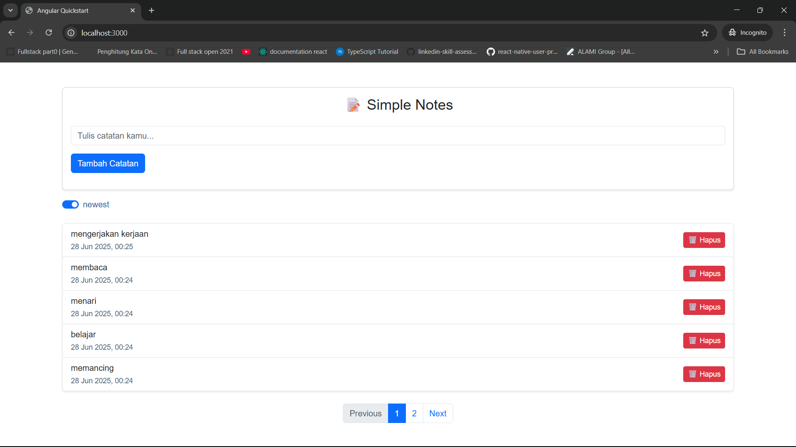

## How To

Sebelum menjalankan aplikasi ini coba untuk pull backend side nya:

```bash
git clone https://github.com/fundayluck/astrapay-spring-boot-external.git
```

dan jalankan aplikasinya. jangan lupa untuk samakan port backendnya ya di `environment.ts`

```
# Clone the repository
git clone https://github.com/fundayluck/angular_simple_note.git

# Navigate into the project directory
cd angular_simple_note

# Install dependencies
npm install

# Start the development server
npm start

# version
node => v18.18.2
npm => 9.8.1
```

# contoh aplikasinya


